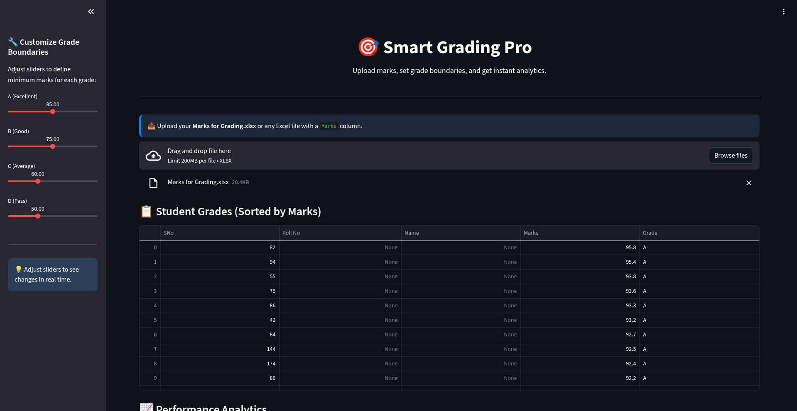
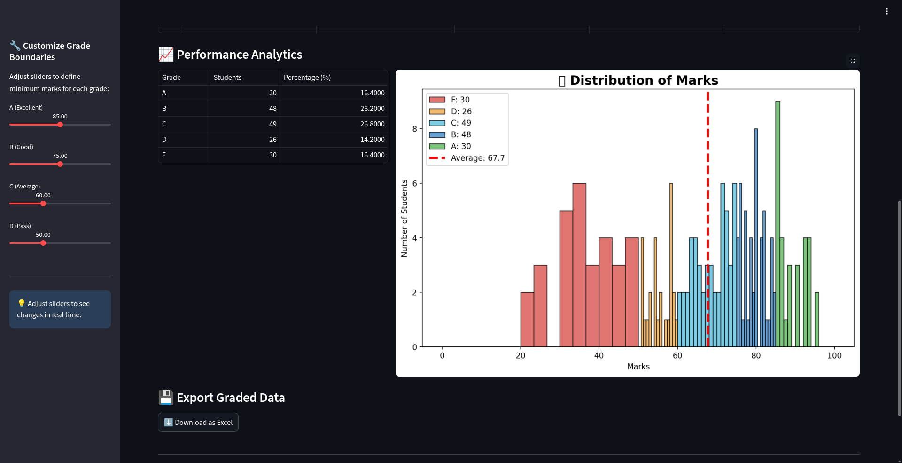

# 🎯 Smart Grading App

A smart, interactive grading application for educators — now available as both a **desktop app (Tkinter)** and a **web app (Streamlit)**.

---

## 🖼️ Screenshot

---

## 🚀 Features

- **Interactive Grading**: Upload Excel files and dynamically assign grades.
- **Customizable Boundaries**: Adjust sliders to set A, B, C, D thresholds.
- **Real-Time Analytics**: View histogram, average, and grade distribution.
- **Export Results**: Download graded data as Excel with one click.
- **Dual Mode**:
  - 🖥️ **Desktop Version**: Run locally using Tkinter (no internet needed)
  - 🌐 **Web Version**: Host online using Streamlit (accessible from anywhere)
- **Modern UI**: Dark mode design with smooth animations and responsive layout.
- **Data Ready**: Works with your existing `Marks` data — no formatting changes needed.

---

## 📁 Data Sample

Your Excel file should include a `Marks` column. Example:

| SNo | Roll No | Name | Marks |
|-----|---------|------|-------|
| 1   |         |      | 33.1  |
| 2   |         |      | 38.0  |
| ... |         |      | ...   |

> ✅ Sample file included: `data/marks_for_grading.xlsx`

---

## 🛠️ Installation

### 1. Clone the Repository
git clone https://github.com/premkumaranubhav/Automated-Grading-Tool.git
cd Automated-Grading-Tool

## 2.Install Dependencies

pip install -r requirements.txt
Requires: streamlit, pandas, matplotlib, openpyxl 

## 🖥️ Run Desktop Version (Tkinter)
Launch the original desktop GUI:

python grading_tool.py
Perfect for offline use in classrooms or personal grading. 

## 🌐 Run Web Version (Streamlit)
Launch the modern web interface:

streamlit run app.py
Open your browser at: http://localhost:8501

Enjoy a smoother, more visual experience with live updates. 

## 📥 How to Use
Web App (app.py)
Click "Upload Excel File" and select a file with a Marks column.
Adjust sliders in the sidebar to set grade boundaries.
View real-time histogram and statistics.
Click "Download as Excel" to save results.
Desktop App (grading_tool.py)
Run python grading_tool.py
Click "Load Excel File"
Adjust sliders for A, B, C, D cutoffs.
Click "Run Grading"
Click "Save As" to export results.

## 🧩 Requirements
streamlit
Web interface
pandas
Data processing
matplotlib
Plotting graphs
openpyxl
Read/write Excel files

numpy is automatically installed with pandas. 

## 📄 License
This project is licensed under the MIT License.

See LICENSE for more details.

## 💬 Feedback & Contributions
Have a feature request? Found a bug? Want to improve the UI?

We welcome contributions! Feel free to:

🐛 Open an issue
🌟 Star the repo
🔁 Submit a pull request
